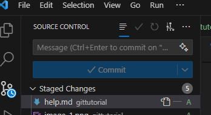

## how to clone a git repo
- `git clone https://github.com/navasakthii/gittutorial.git`

## how to open `terminal` in  `vs code`
- `ctrl + j`

## three important git commands are
- `git add .`
    - this will stage all the changes
- `git commit -m "message"`
    - this will commit all the staged changes

- `git push`
    - this will push the commits to git 

## how to enter into a folder with terminal
- `cd folder name`

## how to come out of a folder with terminal
- `cd ..`

## how to list all the files and folders in the cureent folder
- `ls`

# Never click the commit directly
- 
    - `dont click this commit` 
    - `instead use the terminal to commit`
     