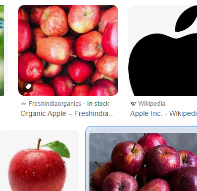

# titlle
## subtitle
### line1
#### line2
##### line3
###### line4

- list1
    - list 1.1
    - list 1.2
    - list 1.3
        - list 1.3.1
        - list 1.3.2
            - list 1.3.2.1

`git clone url`

print hello word

```
print hello word
```


```
print("hello word")
```



